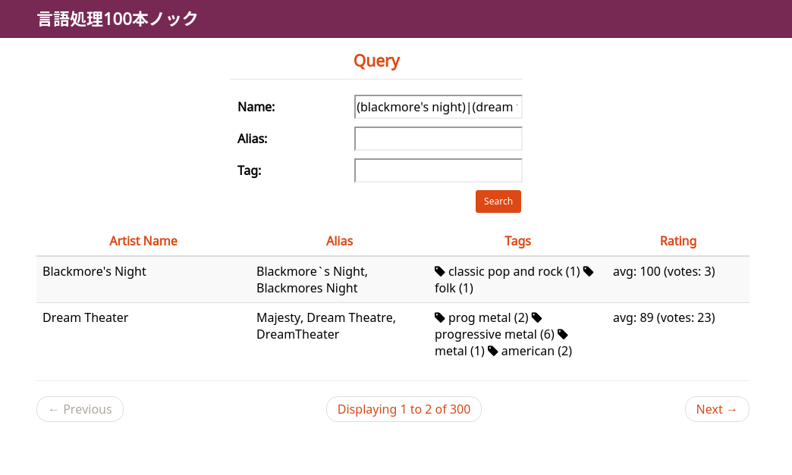

This is an implementation of
[言語処理100本ノック](http://www.cl.ecei.tohoku.ac.jp/nlp100/)
written in Scala.

```
sbt "run-main nlp100.chapter##.Q##"
```

The directory `Q69` contains a web application to list `artist.json`.

