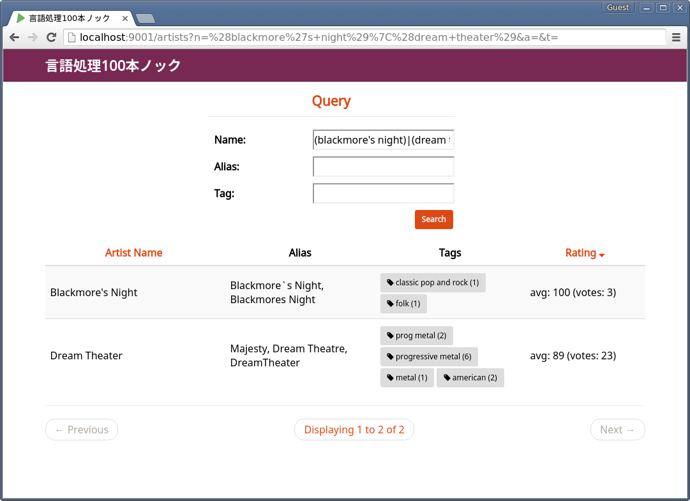

# 言語処理100本ノック

This is an implementation of
[言語処理100本ノック](http://www.cl.ecei.tohoku.ac.jp/nlp100/)
written in Scala.

To run a code, install sbt and type the following command.
```
sbt "run-main nlp100.chapter##.Q##"
```

The 69th question requires a web application.
I created one in the directory `Q69`.
To run it, please have a look at `Q69/README.md`.
It will look like this.

<p style="text-align: center;">

</p>
